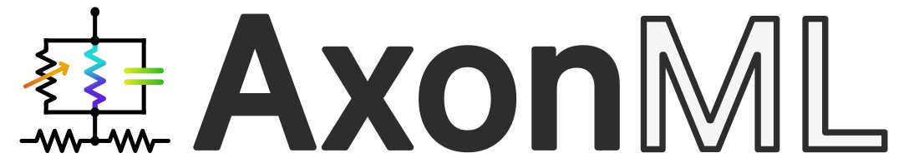

<div align="center">
  
</div>

***

[](https://pytorch.com)
[](https://www.python.org/downloads/)
[](https://github.com/psf/black)

Fast, scalable, versatile, and differentiable neural simulator with support for extracellular fields. Useful to implement and train high-throughput GPU-compatible models.

## Documentation

During internal development, the full documentation is available through
[GitLab Pages](https://dendra-dev.pages.oit.duke.edu/dendra/). Its
[source](docs/index.rst) is maintained with the repository and remains readable
on either host. See the [unit conventions](docs/units.rst) for the distinct
distributed-mechanism, point-process, stimulation, and material contracts.

## Requirements

### OS requirements

`dendra` has been tested on Windows 11 under WSL2 (Ubuntu 22.04), Linux (AlmaLinux v9.3, binary-compatible with Red Hat Enterprise Linux), and macOS (Tahoe 26.3).

### Python dependencies

`dendra` requires Python 3.11 or newer and PyTorch 2.12 or newer. PyTorch and
NEURON are installed as package dependencies. GPU use requires a CUDA-capable
PyTorch build compatible with the host driver.
On Windows, install inside WSL2 because the required NEURON dependency does not
publish native Windows wheels on PyPI.

## 🖥️ Installation

### From a source checkout

Until the first Dendra release is published on PyPI, install from your source
checkout. From the repository root, install the package with the recommended
native CPU solvers:

```bash
python -m pip install --upgrade pip
python -m pip install ".[solvers]"
```

Use `python -m pip install .` if no compatible `dendra-solvers` distribution is
available. The development section below describes editable installations.

### From PyPI

Once the Dendra distribution is published, create and activate an isolated
Python environment, then install it with the recommended native CPU solvers:

```bash
python -m pip install --upgrade pip
python -m pip install --only-binary=dendra-solvers "dendra[solvers]"
```

This includes [`dendra-solvers`](https://pypi.org/project/dendra-solvers/).
If no compatible solver distribution is available, install the base package:

```bash
python -m pip install dendra
```

The base package retains Dendra's PyTorch CPU solver for unbranched cables and
all GPU solvers. CPU block and tree methods require `dendra-solvers`.

`pip` installs a compatible PyTorch release automatically. To select a specific
CPU, CUDA, or ROCm build, install PyTorch first using its
[installation selector](https://pytorch.org/get-started/locally/), then install
Dendra. See the [installation guide](docs/installation.md)
for virtual-environment, solver-wheel, source-installation, and verification
instructions.

For interactive Matplotlib figures in Jupyter, install:

```bash
python -m pip install "dendra[jupyter]"
```

Restart the entire Jupyter server, select `%matplotlib widget`, and see the
[interactive Jupyter setup](docs/installation.md#interactive-jupyter-figures)
when the server and kernel use different environments.

Check the installed dependencies and inspect the PyTorch/CUDA deployment
environment with:

```bash
python -m pip check
python -m dendra doctor
```

If you installed the recommended CPU solvers, verify their compiled extension
separately:

```bash
python -c "import dendra_solvers._ext as ext; print(ext.__file__)"
```

### ⚙️ Installing for development

For development, use the repository checkout on the host available to you and
follow the contribution guide. From the repository root, install Dendra in
editable mode and enable the commit hooks:

```bash
python -m pip install --editable ".[dev,solvers]"
pre-commit install
pre-commit install --hook-type commit-msg
```

Use `python -m pip install --editable ".[dev]"` for development without native CPU solvers.
See the [contribution guide](CONTRIBUTING.md)
for the development and pull-request workflow.

### GPU deployment diagnostics

Run the deployment doctor after installing Dendra:

```bash
dendra doctor --require-cuda
# Equivalent when the console script is not on PATH:
python -m dendra doctor --require-cuda
```

The default doctor is inspection-only: it reports the PyTorch/CUDA runtime,
visible GPUs, NVCC and C++ compiler discovery, CUDA-version alignment, packaged
native sources, selected GPU architectures, cache writability, and matching
cached artifacts without compiling, loading, or launching a native extension.
An explicit probe opts into a JIT build and tiny end-to-end kernel smoke test:

```bash
dendra doctor --require-cuda --probe-native-bitpack
```

The optional NetCon CUDA extension retains its correct pure-PyTorch fallback by
default. Deployments that must not silently change performance paths can scope a
stricter policy locally:

```python
import dendra as dn

with dn.ctx(NATIVE_EXTENSION_POLICY="require"):
    network.run(...)
```

The supported policies are `"fallback"` (default), `"warn"`, and
`"require"`. Set `NATIVE_EXTENSION_POLICY=require` before importing Dendra
to make the policy process-wide. It is enforced only when an eligible native
CUDA path is attempted; CPU and dense-backend execution are unaffected.

## ✅ Testing and code coverage

Install `.[dev,solvers]` from a source checkout for the full CPU test suite and coverage checks; the development dependencies include `pytest` and `pytest-cov`. Run the complete test suite from the repository root with:

```bash
python -m pytest tests
```

Tests are classified into execution lanes. The required CI lane combines the portable CPU suite with every non-CUDA NEURON integration and reference test:

```bash
python -m pytest tests -W error -m "cpu or (neuron and not cuda)"
```

This expression runs each selected test once: `cpu` covers tests that require neither CUDA nor NEURON, while `neuron and not cuda` adds the required simulator-backed CPU tests without pulling GPU comparisons into the lane. CUDA and Triton-dependent cases remain separate and can be selected with `-m cuda`; `-m "neuron and cuda"` narrows that lane to NEURON comparisons on CUDA. Longer comparisons also carry `slow`, and randomized/property-generated cases carry `stochastic`. Markers are strict, so misspelled or undeclared markers fail during collection.

On a CUDA/Triton worker, run the accelerator lane independently:

```bash
python -c "import torch, triton; assert torch.cuda.is_available()"
python -m pytest tests -W error -m cuda
```

The native NetCon CUDA kernels also have a dedicated Compute Sanitizer lane:

```bash
python scripts/run_cuda_sanitizers.py
```

This runs memcheck, racecheck, initcheck, and synccheck with source line
information. For reliable initcheck results, the CUDA toolkit used to compile
the native extension must have the same major version as PyTorch's CUDA
runtime; the runner detects mismatches, skips initcheck in the all-tools lane,
and explains how to restore that coverage. On WSL with a WDDM GPU, sanitizer
availability can depend on Windows driver and debugging-interface support; see
NVIDIA's
[operating-system-specific Compute Sanitizer documentation](https://docs.nvidia.com/compute-sanitizer/ComputeSanitizer/index.html#operating-system-specific-behavior).

Keep accelerator coverage artifacts separate from the required CPU/NEURON percentage. Kernel correctness is enforced primarily through dense numerical oracles, gradient checks, boundary-shape contracts, and backend-equivalence tests. The required CPU report uses `.coveragerc.cpu` to omit only the seven accelerator-only Triton kernel bodies; their contracts, dispatch and fallback paths, network Triton operations, and GPU diagnostics remain in its coverage denominator.

To measure both statement and branch coverage, print uncovered line numbers in the terminal, and generate a browsable HTML report:

```bash
python -m pytest tests -W error -m "cpu or (neuron and not cuda)" --cov=dendra --cov-branch --cov-config=.coveragerc.cpu --cov-report=term-missing:skip-covered --cov-report=json:coverage.json --cov-report=html
```

The `TOTAL` row is the overall coverage result. Open `htmlcov/index.html` to inspect coverage by module and identify untested lines and branches. The required lane installs and exercises NEURON and the CPU solvers; accelerator execution remains outside this measurement, while CPU-testable CUDA/Triton interfaces remain covered.

GitLab CI runs this same non-CUDA branch-coverage measurement for every pipeline, enforces a ratcheted 84% global minimum, and retains JSON, browsable HTML, and Cobertura reports. Critical modules also have individual floors configured in `coverage-floors.toml`; validate them locally after generating `coverage.json` with:

```bash
python scripts/check_coverage_floors.py coverage.json
```

## 🔍 Citation

If you use Dendra, please cite...(paper forthcoming).

Please also consider citing the work where geometric / topological surrogates and gradient-based design of selective neurostimulation are discussed in detail:

Minhaj A. Hussain, Warren M. Grill, Nicole A. Pelot. "Highly efficient modeling and optimization of neural fiber responses to electrical stimulation." *Nature Communications.* 2024. [(nature.com)](https://www.nature.com/articles/s41467-024-51709-8)

```
@article{hussain_highly_2024,
    title = {Highly efficient modeling and optimization of neural fiber responses to electrical stimulation},
    doi = {10.1038/s41467-024-51709-8},
    journal = {Nature Communications},
    author = {Hussain, Minhaj A. and Grill, Warren M. and Pelot, Nicole A.},
    year = {2024}
}
```


## 📜 License

The copyrights of this software are owned by Duke University. As such, it is offered under a custom license (see LICENSE.md) whereby:

1. DUKE grants YOU a royalty-free, non-transferable, non-exclusive, worldwide license under its copyright to use, reproduce, modify, publicly display, and perform the PROGRAM solely for non-commercial research and/or academic testing purposes.

2. In order to obtain any further license rights, including the right to use the PROGRAM, any modifications or derivatives made by YOU, and/or PATENT RIGHTS for commercial purposes, (including using modifications as part of an industrially sponsored research project), YOU must contact DUKE’s Office for Translation and Commercialization (Digital Innovations Team) about additional commercial license agreements.

Please note that this software is distributed AS IS, WITHOUT ANY WARRANTY; and without the implied warranty of MERCHANTABILITY or FITNESS FOR A PARTICULAR PURPOSE.
